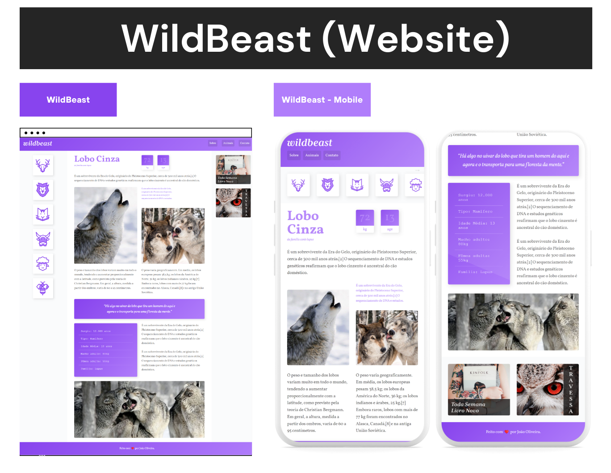

# WildBeast 🐺

O WildBeast foi desenvolvido durante o curso CSS Grid Layout, da Origamid. Onde pude aprender
a criar layouts responsivos no CSS utilizando as propriedades do sistema de grid.

Então criei o WildBeast para colocar em prática os aprendizados do curso.

## 🛠️ Tecnologias

- CSS - Grid
- HTML

## 💙 Contato

joaoliveira.batista1@gmail.com
